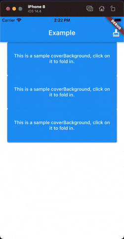

# Flutter Romantic Folding Card

A Flutter package to create a Romantic Folding Card. It will be useful for your awesome app.

This is a present from Romantic Project. More from [Romantic Developer](https://pub.dev/publishers/romanticdeveloper.com/packages)



### Example

```dart
import 'package:flutter/material.dart';
import 'package:flutter_folding_card/flutter_folding_card.dart';

void main() => runApp(MyApp());

const _kImageUrls = [
  "https://scontent-hkg4-1.xx.fbcdn.net/v/t1.6435-9/240669493_3093165274342302_7696944317595605164_n.jpg?_nc_cat=107&ccb=1-5&_nc_sid=730e14&_nc_ohc=QRmRTo3bJOQAX_u8ELe&_nc_ht=scontent-hkg4-1.xx&oh=374ca65aaff7a46dfd4d2f14aff72b11&oe=614F64BC",
  "https://scontent-hkg4-2.xx.fbcdn.net/v/t1.6435-9/240758821_3092745557717607_1758983175902930666_n.jpg?_nc_cat=109&ccb=1-5&_nc_sid=730e14&_nc_ohc=z0srgae32A4AX_oURvc&_nc_ht=scontent-hkg4-2.xx&oh=e981297264aca64a25aaf285259f41d7&oe=614CDEA1",
  "https://scontent-hkg4-1.xx.fbcdn.net/v/t1.6435-9/240624734_3092487924410037_2111143168440995076_n.jpg?_nc_cat=107&ccb=1-5&_nc_sid=730e14&_nc_ohc=TZukbOFjxowAX8IYthH&_nc_ht=scontent-hkg4-1.xx&oh=59dd511589b6dbdea97a3b478b5d629f&oe=614D9448",
  "https://scontent-hkg4-1.xx.fbcdn.net/v/t1.6435-9/s640x640/237446804_3091585131166983_1116147550483070313_n.jpg?_nc_cat=105&ccb=1-5&_nc_sid=8bfeb9&_nc_ohc=5QCW7JFNQoAAX-Suuyv&_nc_ht=scontent-hkg4-1.xx&oh=ca4d078c57e9b95815d6facb38bef7db&oe=614C87E3",
];

class MyApp extends StatefulWidget {
  @override
  _MyAppState createState() => _MyAppState();
}

class _MyAppState extends State<MyApp> {
  final itemCount = 3;
  final foldOutList = <bool>[false, false, false];

  @override
  Widget build(BuildContext context) {
    return MaterialApp(
      title: 'Example',
      theme: ThemeData(
        primarySwatch: Colors.blue,
      ),
      home: Scaffold(
        appBar: AppBar(
          title: Text('Example'),
          actions: [
            IconButton(
              onPressed: () {
                setState(() {
                  for (var i = 0; i < foldOutList.length; ++i) {
                    foldOutList[i] = false;
                  }
                });
              },
              icon: Icon(Icons.cleaning_services_sharp),
            ),
          ],
        ),
        backgroundColor: Colors.white,
        body: ListView.builder(
          itemBuilder: (context, index) {
            return Padding(
              padding: const EdgeInsets.only(left: 22.0, right: 22),
              child: FoldingCard(
                foldOut: foldOutList[index],
                curve: foldOutList[index] == true
                    ? Curves.easeInCubic
                    : Curves.easeOutCubic,
                duration: Duration(milliseconds: 1400),
                coverBackground: ElevatedButton(
                  onPressed: () {
                    setState(() {
                      foldOutList[index] = true;
                    });
                  },
                  child: Text(
                    'This is a sample coverBackground, click on it to fold in.',
                    textAlign: TextAlign.center,
                  ),
                ),
                expandedCard: index == 1
                    ? Stack(
                        children: [
                          Image.network(
                            _kImageUrls[3],
                            fit: BoxFit.fitWidth,
                            width: MediaQuery.of(context).size.width,
                            alignment: Alignment.topCenter,
                          ),
                          Center(
                            child: ElevatedButton(
                              onPressed: () {},
                              child: Text(
                                'This is a other sample for expandedCard.',
                              ),
                            ),
                          )
                        ],
                      )
                    : Image.network(
                        _kImageUrls[1],
                        fit: BoxFit.cover,
                        width: MediaQuery.of(context).size.width,
                        alignment: Alignment.topCenter,
                      ),
                cover: ElevatedButton(
                  style: ButtonStyle(
                    padding: MaterialStateProperty.all(EdgeInsets.zero),
                  ),
                  onPressed: () {
                    setState(() {
                      foldOutList[index] = false;
                    });
                  },
                  child: Image.network(
                    _kImageUrls[2],
                    fit: BoxFit.fitWidth,
                    width: MediaQuery.of(context).size.width,
                    alignment: Alignment.topCenter,
                  ),
                ),
                foldingHeight: 100,
                expandedHeight: 300,
              ),
            );
          },
          itemCount: itemCount,
        ),
      ),
    );
  }
}
```

### Development environment

```
[✓] Flutter (Channel stable, 2.2.3, on macOS 11.2.3 20D91 darwin-x64, locale en-VN)
    • Flutter version 2.2.3 at ~/fvm/versions/stable
    • Framework revision f4abaa0735 (9 weeks ago), 2021-07-01 12:46:11 -0700
    • Engine revision 241c87ad80
    • Dart version 2.13.4

[✓] Android toolchain - develop for Android devices (Android SDK version 30.0.3)
    • Android SDK at ~/Library/Android/sdk
    • Platform android-30, build-tools 30.0.3
    • ANDROID_HOME = ~/Library/Android/sdk
    • Java binary at: /Applications/Android Studio.app/Contents/jre/jdk/Contents/Home/bin/java
    • Java version OpenJDK Runtime Environment (build 1.8.0_242-release-1644-b3-6915495)
    • All Android licenses accepted.

[✓] Xcode - develop for iOS and macOS
    • Xcode at /Applications/Xcode_12.app/Contents/Developer
    • Xcode 12.4, Build version 12D4e
    • CocoaPods version 1.10.1

[✓] Android Studio (version 4.1)
    • Android Studio at /Applications/Android Studio.app/Contents
    • Flutter plugin can be installed from:
      🔨 https://plugins.jetbrains.com/plugin/9212-flutter
    • Dart plugin can be installed from:
      🔨 https://plugins.jetbrains.com/plugin/6351-dart
    • Java version OpenJDK Runtime Environment (build 1.8.0_242-release-1644-b3-6915495) 
```